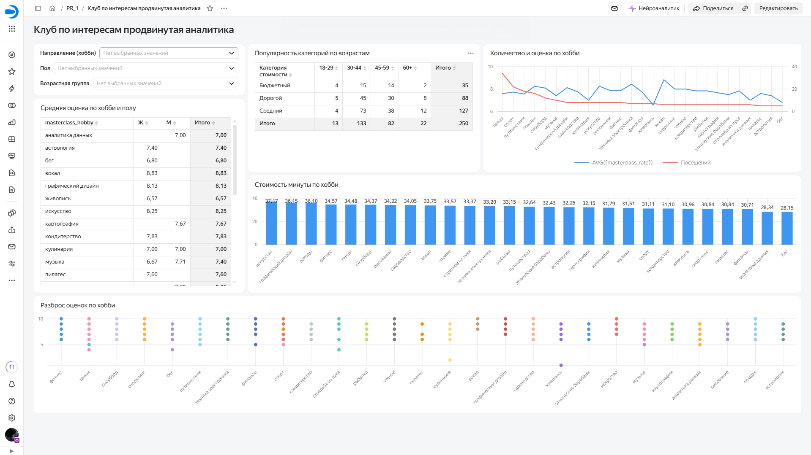

# Многомерный факторный анализ и сегментация аудитории в Yandex DataLens

Продвинутая аналитика и сегментация клиентов клуба по интересам в Yandex DataLens: вычисляемые поля, сводные таблицы, двухосевые чарты и анализ разброса оценок.

**Инструменты и стек:** Yandex DataLens, Feature Engineering, Pivot Tables, двухосевые чарты, сегментация  
**Интерактивный дашборд:** [открыть в Yandex DataLens](https://datalens.yandex/36py7sg2lxhsm?_share_link=public)

---

## Дашборд

*Нажмите на скриншот, чтобы открыть интерактивную версию с работающими фильтрами.*

---

## Задачи проекта

1. **Вычисляемые поля:** `IF`, `CONCAT`, категоризация возраста (`age_group`: 18–29, 30–44, 45–59, 60+) и стоимости (`cost_category`: бюджетный, средний, дорогой), удельная стоимость минуты мастер-класса.
2. **Сводные таблицы (Pivot):**
   * средняя оценка по хобби в разрезе пола;
   * популярность ценовых категорий по возрастным группам.
3. **Комбинированный чарт с двумя независимыми осями $Y$:** количество посещений и средняя оценка по каждому хобби.
4. **Стоимость минуты по хобби** — столбчатая диаграмма для сравнения удельной цены направлений.
5. **Разброс оценок по хобби** — точечная диаграмма для анализа вариативности оценок.
6. **Селекторы и параметры:** фильтрация по направлению, полу и возрастной группе.

---

## Ключевые выводы

* Основная аудитория — группа **30–44 лет** (133 из 250 посещений); самая популярная ценовая категория — **средняя** (127 посещений).
* Самая дорогая минута занятия — у направлений «искусство», «графический дизайн» и «походы» (≈ 36–37 руб./мин), самая дешёвая — у «аналитики данных» и «бега» (≈ 28 руб./мин).

---

## Структура проекта

* `images/dashboard.jpg` — скриншот итогового дашборда.
* `README.md` — описание проекта.

---

[⬅ Вернуться на главную страницу портфолио](https://github.com/mirilina/mirilina)
